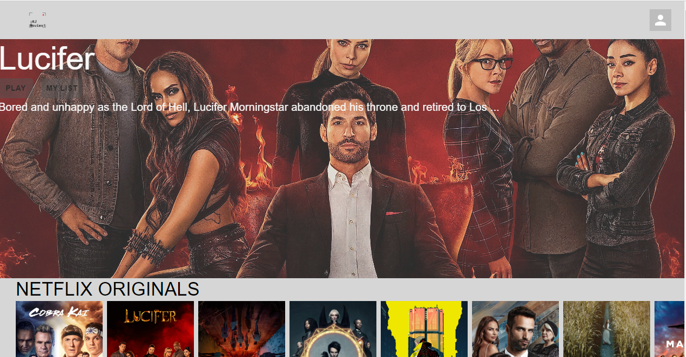
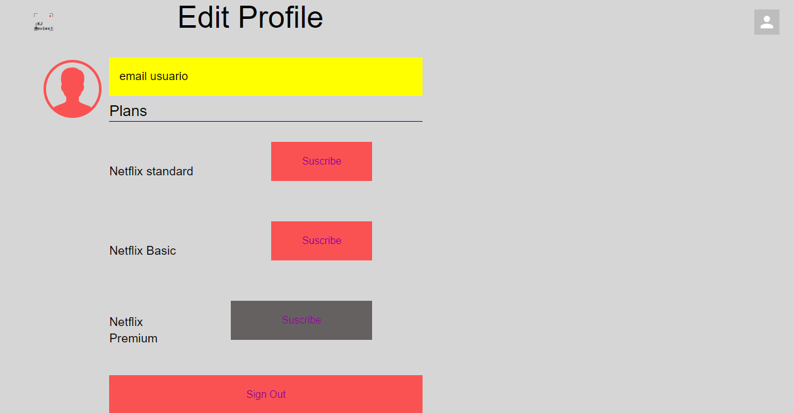
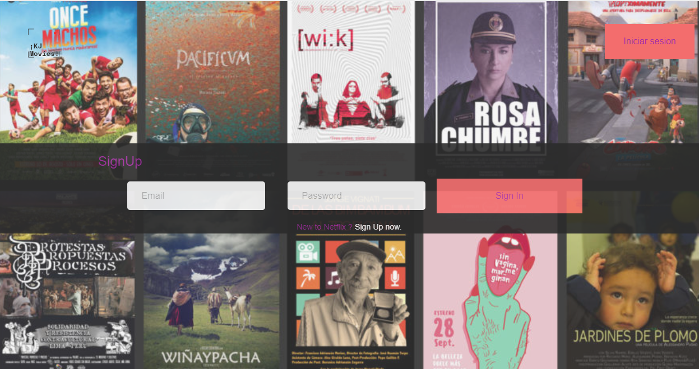
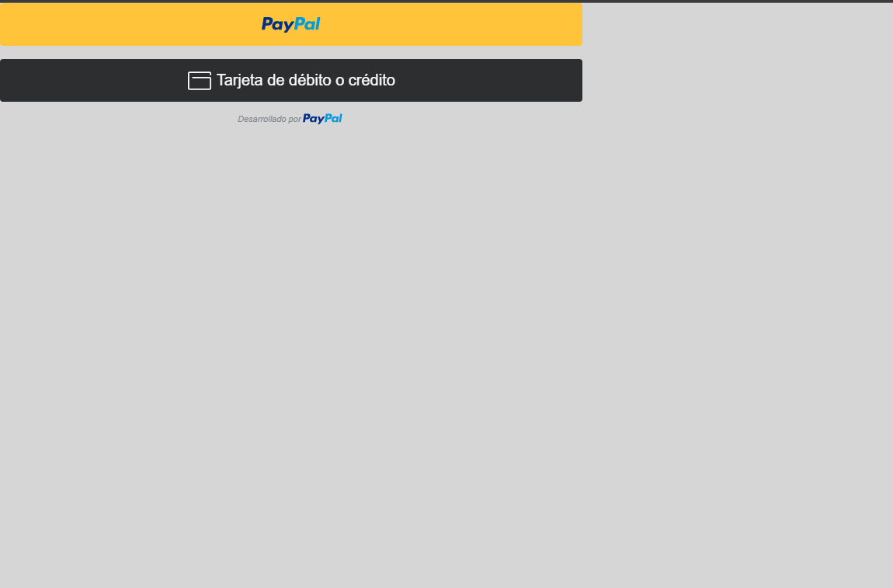
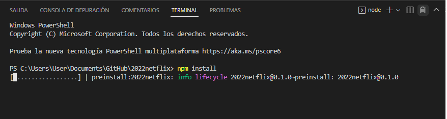
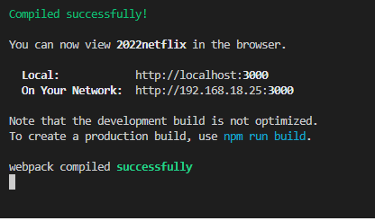

# Welcome to the Page of Streaming App! 🎞🎥🎬
An application whose purpose is to acquire the different memberships for the streaming service through a payment system. 
Counting on a large number of series and movies which the user will have access through standard, basic and premium memberships. 
Using "Paypal" as payment method

# Steps to run the project 🚨:

  
  
  
  

1.- Once the project is downloaded, access the terminal of your console.

    * - To access open the terminal (Control + Ñ) or (Terminal - New Terminal).
    * - Run the command "npm install"
   

  

Once having the first step perfectly, we proceed to execute the environments

  

## More info about me: 

Ing. Kevin J. Montero Zea 

CE: 004712881 🆔

+51-913-695-382 📱

<a href="https://www.linkedin.com/in/kevin913montero/">
    LinkedIn 👨‍🦰
  </a>

<a href="https://portfoliokjmz.netlify.app/">
    Portfolio 💼
  </a>

